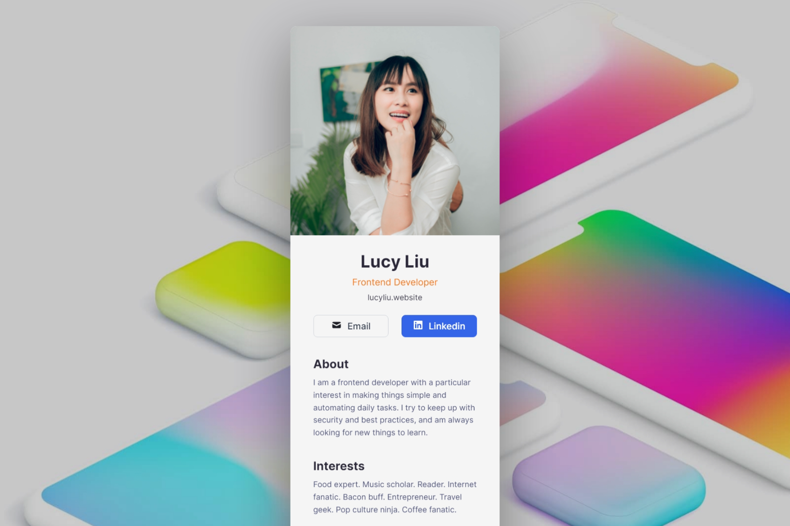

# Digital business card - <small>Scrimba React Course Project 2</small>
First Solo Project - a digital business card.

 Requirements
- Build from scratch!
- Fill in your own information
- Separate componets for:
    - Info(photo, name, buttons, etc.)
    - About
    - Interests

